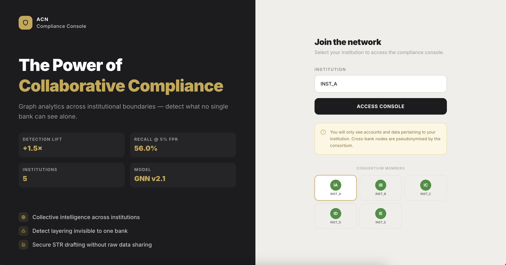
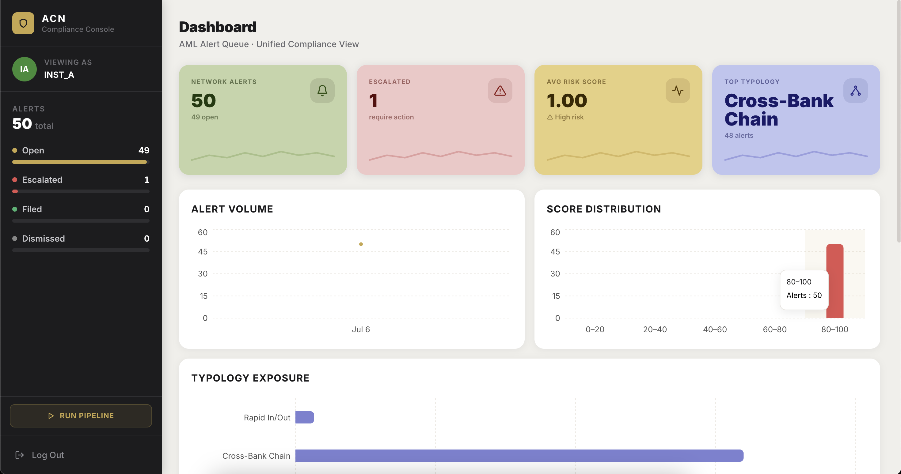
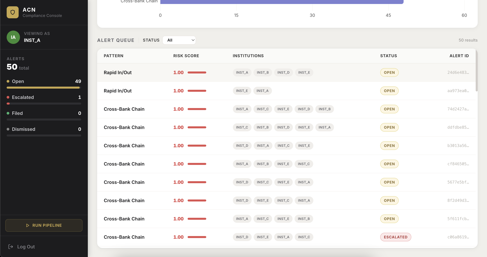
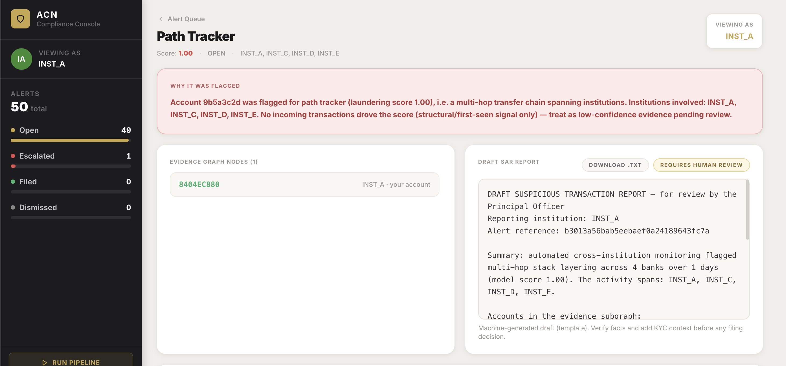
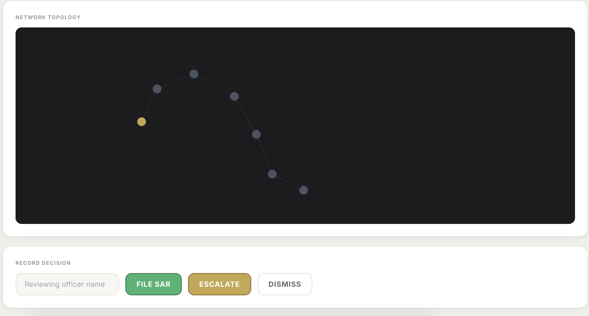

# ACN — AML Consortium Network

A privacy-preserving system in which five financial institutions collaboratively detect **cross-institution transaction layering** without sharing raw transaction data. Each bank publishes only **pseudonymised** transaction edges (HMAC-hashed accounts, fixed amount buckets); these merge into one shared graph where the *same real account collapses to a single node* — regardless of which bank reported it — making cross-bank laundering chains visible that no single institution could see. The output is a stream of **ranked, explainable alerts** — each with its evidence subgraph — routed only to the institutions involved.

---

## Architecture Overview


*The end-to-end architecture demonstrating the flow from siloed financial institutions, through secure mTLS Kafka streaming, into the Neo4j-backed Graph Engine, ending in the Next.js compliance console.*

### Core Technology Stack
- **Graph Database & Detection:** Neo4j (Cypher queries for topological structure)
- **Message Broker:** Apache Kafka (with strict mTLS and ACLs)
- **Machine Learning:** PyTorch & PyTorch Geometric (DirMultigraphSAGE, GNNExplainer)
- **Backend API:** FastAPI (Python 3.11)
- **State & Resolution:** Redis (AOF enabled for persistence)
- **Frontend / UI:** Next.js (React, Tailwind CSS, react-force-graph-2d)
- **Local AI:** Ollama (for offline LLM-driven SAR drafting)

---

## Non-Negotiable Privacy Invariants

The design of the ACN is built around absolute zero-knowledge privacy principles:
- **No Raw Data Leaves the Bank:** Raw transaction data never leaves an institution. Only pseudonymised edges cross an institution's boundary.
- **HMAC-SHA256 Hashing:** Accounts are hashed using an HMAC-SHA256 algorithm keyed strictly on the **owning** institution's ID and a shared network salt (`ACN_SHARED_SALT`). 
- **Owner-Side Resolution:** The central graph never possesses the ability to un-hash accounts. When an alert reaches an institution's compliance console, the UI resolves *only* the accounts belonging to that specific institution. Other bank's accounts remain cryptographically obfuscated.
- **Amount Bucketization:** Exact dollar amounts are never shared. Transactions are mapped into non-reversible, fixed `amount_buckets` before leaving the institution.
- **Decentralized Alert Routing:** Alerts are routed exclusively to the institutions whose accounts appear in the evidence. There is no central broadcasting.
- **Privacy-Preserving AI:** The GraphSAGE model trains entirely on the pseudonymised merged graph. The model never sees raw data.

---

## How It Works: The Deep Pipeline

### 1. Data Foundation & Partitioning (`acn/data/`)
The system is built to ingest the IBM AML simulated dataset. The data pipeline (`build_dataset.py`) ensures that known laundering chains are preserved in their entirety while partitioning the normal background traffic across five distinct (non-IID) financial institutions (`INST_A` through `INST_E`).

### 2. Pseudonymisation & Streaming (`acn/pseudonymise/`)
Each participating institution acts as an independent publisher. Using `hashing.py` and `buckets.py`, banks apply cryptographic hashes to account numbers. These encrypted edges (containing `src_hash`, `dst_hash`, `amount_bucket`, and `timestamp`) are securely published to an Apache Kafka broker over mutual TLS (mTLS). Kafka topics are strictly partitioned by institution (e.g., `edges_INST_A`).

### 3. Graph Engine Ingestion (`acn/graph/`)
A central Python-based Graph Engine constantly consumes from the Kafka topics. It writes these edges into a centralized **Neo4j** graph database. Because the hashing algorithm is deterministic across the network, when two banks interact with the same external account, those edges automatically collapse onto a single, pseudonymised node, creating a unified cross-institution knowledge graph.

### 4. Cypher Detection Layers (`acn/graph/layers/`)
Instead of purely relying on black-box ML, the engine applies six deterministic topological queries (written in Cypher) to detect known structural patterns. These layers represent the core typologies of money laundering:
1. **Sliding Window:** Detects rapid layering hops where funds move in and out of an account within a tight time window.
2. **Path Tracker:** Looks for 30-day multi-hop stacks across multiple institutions.
3. **Round Trip:** Identifies cyclical laundering (boomerangs) where funds originate and return to the same entity.
4. **Flow Conservation:** Flags "pass-through mules" whose incoming flows perfectly match their outgoing flows.
5. **Coordinated New Accounts:** Detects "fan-in gathers" where multiple newly created accounts funnel money into a single node.
6. **Fan Out:** Identifies "scatter" patterns where a single node disperses funds to a wide network of accounts.

### 5. Graph Neural Network Scoring (`acn/gnn/`)
The engine employs a **DirMultigraphSAGE** model built with PyTorch Geometric. The structural patterns discovered by the Cypher layers are aggregated into a highly dense "chain-aware feature block." This allows the highly efficient 2-hop GraphSAGE model to key off long-range, multi-hop laundering chains that would otherwise exceed its receptive field. The alert score for any candidate chain is calculated as the maximum laundering probability across its subgraph.

### 6. Explainability via GNNExplainer (`acn/explain/`)
For high-confidence alerts, the pipeline triggers **GNNExplainer**. This subsystem analyzes the neural network's activation and extracts exactly *which* edges and nodes contributed most to the laundering score. It translates this back into a plain-language evidence string (e.g., *"Account X acted as a pass-through mule, forwarding funds to Account Y"*).

### 7. Case Management & Draft STRs (`acn/casemgmt/`)
Alerts generated by the scoring layer are grouped into Cases and stored in Redis. When a compliance officer logs into the UI, the backend resolves their owned accounts and provides an automated, machine-generated Suspicious Transaction Report (STR) draft detailing the exact activity, the institutions involved, the duration, and the basis for suspicion. The draft can optionally be enriched using a localized Ollama LLM to produce fluent regulator-style prose without ever sending data to external APIs.

---

## Compliance Console (UI)

The ACN frontend (`frontend/`) is a Next.js application that provides compliance teams with a comprehensive, secure view of their alerts.

### 1. Authentication

*Secure login portal restricting access to the compliance queue based on the specific institution's namespace.*

### 2. Alert Queue Dashboard



*The centralized dashboard where analysts can triage and filter alerts by risk score, detected pattern, and current status.*

### 3. Case Investigation

*The core investigation view detailing the evidence subgraph and providing a gate for officers to File, Escalate, or Dismiss alerts.*

### 4. Interactive Topology Visualizer

*Uses `react-force-graph-2d` to render the transaction network interactively. The UI safely translates owned hashes back into readable account IDs while keeping other institutions' nodes completely obfuscated.*

### 5. Automated SAR Drafting
*Machine-generated STR drafts detail the suspicious activity. The text can be edited and directly exported as `.txt` files to the officer's desktop for official filing.*

---

## Repository Structure

```text
acn/            Reusable Python, one sub-package per domain:
                data/         IBM AML dataset parsing and partitioning
                pseudonymise/ mTLS Kafka producers/consumers, hashing & bucketization
                graph/        Neo4j ingestion, 6 Cypher layers, alert generation
                gnn/          DirMultigraphSAGE model, feature extraction
                explain/      GNNExplainer implementations for evidence generation
                casemgmt/     Owner-side Redis resolution, STR templates, API logic
services/       api/          FastAPI backend running /health and /cases endpoints
frontend/       app/          Next.js compliance console (React + Tailwind)
scripts/        Data build, model training, resolve-map build, cert gen, E2E runners
tests/          pytest        Deterministic units + gated `requires_services` integration
config/         redis.conf, Kafka client-ssl template
certs/          mTLS material (CA, keystores, truststores - generated locally)
docs/           Documentation assets (images, architectures)
```

---

## Runbook & Setup

For complete instructions on booting the local infrastructure (Kafka, Neo4j, Redis, Ollama, FastAPI), executing the end-to-end data pipeline, and running the comprehensive test suite, please refer to the primary runbook:

👉 **[See TESTING.md](TESTING.md)**

---

*AML Consortium Network — Secure, Privacy-Preserving Financial Collaboration.*
